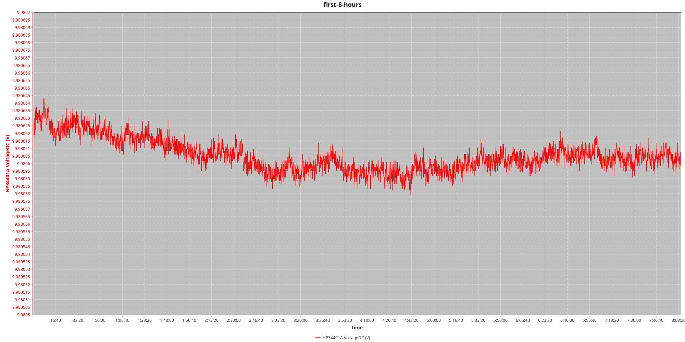

# LM399 Voltage Reference

## 8 hours

* First: 9.9806234 
* Last: 9.9805964
* Min: 9.9805736
* Max: 9.9806473
* Range: 73.7 uV
* AVG: 9.980605185
* Slope: 206.6029184 pV

## 300 s

* Current: 9.9806007
* Min: 9.9805899
* Max: 9.9806126
* Range: 22.7 uV
* AVG: 9.980601305
* Slope: -2.958961737 nV
